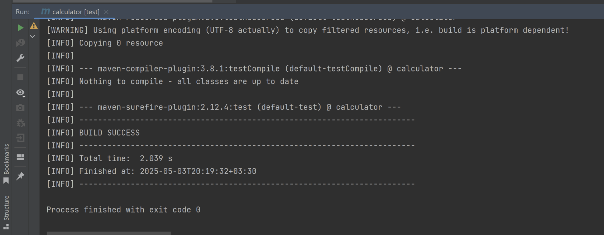
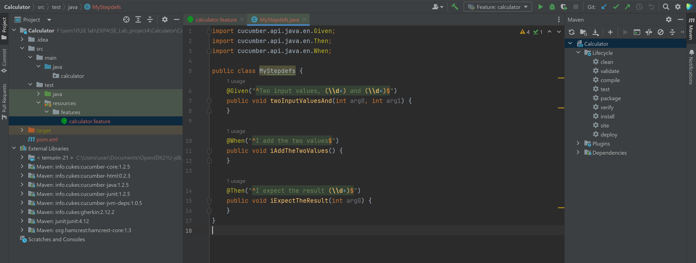
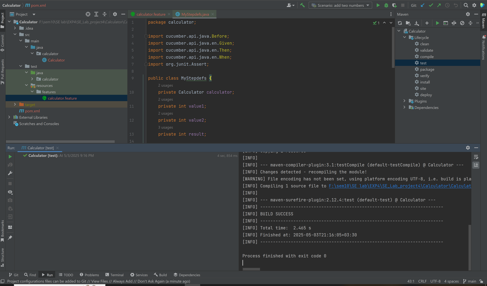
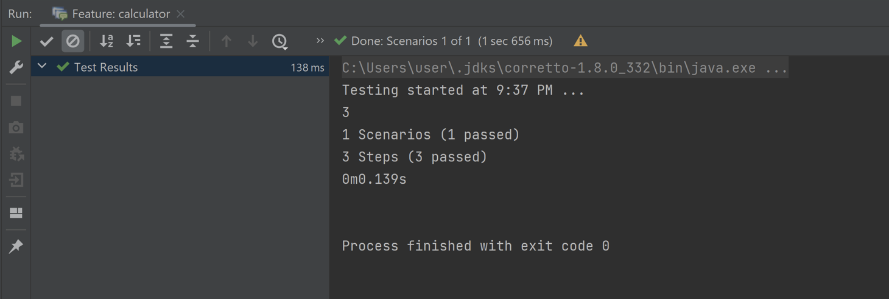
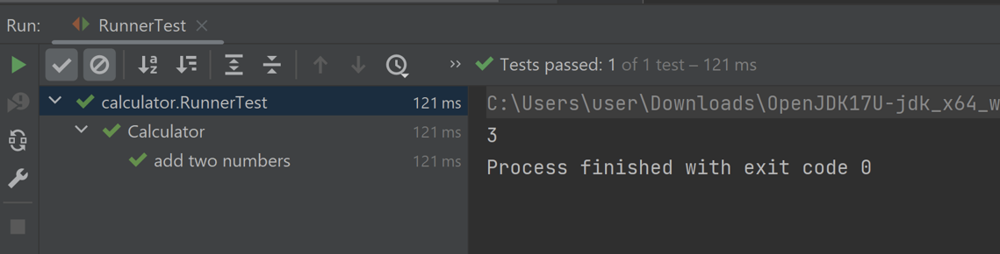
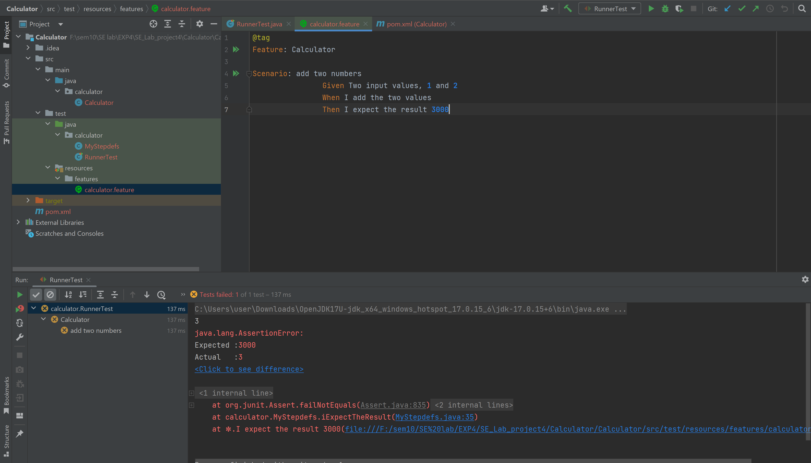
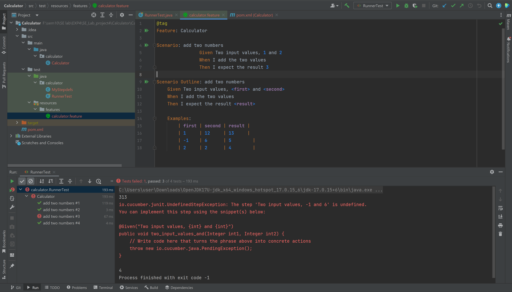
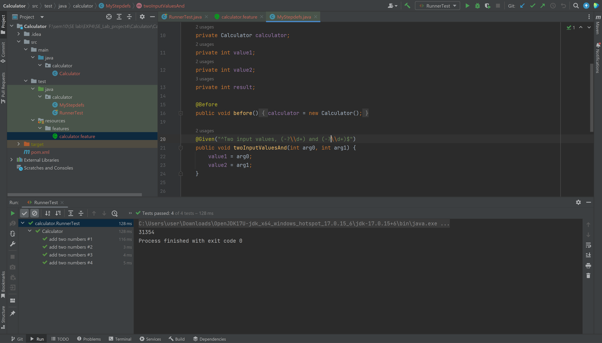

# گزارش آزمایش ۴ 
## بخش اول و دوم: پیاده سازی مثال ماشین حساب
ابتدا وابستگی های مورد نیاز را اضافه میکنیم و سپس تست میگیریم تا پیام "با موفقیت بیلد شدن" را ببینیم:

درادامه فایل فیچرها را تشکیل داده و سناریوی جمع دو عدد را تعریف کردیم. سپس فایل مراحل اجرای سناریو را تشکیل دادیم:

در ادامه متد های این توابع بالا را طبق داک تکمیل کردیم و همچنین تابع جمع دو عدد را هم نوشتیم. در ادامه ورژن کامپایلر را هم به تنظیمات اضافه و مجدد میون تست میگیریم تا از موفقیت آمیز بودن روند مطمئن شویم:

حال سناریویی که نوشتیم را ران میگیریم:

حال کلاس رانر را ایجاد میکنیم و ران میگیریم:

و میبینیم که اگر اعداد سناریو را عوض کنیم، تست ها پاس نمیشوند:

حال در فایل فیچرها، سناریوی اوت لاین را اضافه میکنیم و میبینیم که پاس نمیشوند:

در تست کیس دوم این اوت لاین، عدد اول مقداری منفی است. ولی در مراحلی که در MyStepdefs.java تعریف کردیم تنها اعداد مثبت را در رجکس درنظر گرفته ایم که با تغییر این رجکس به -?\\d+ میبینیم تست ها مجدد پاس میشوند: 

## بخش ۳
### پیاده‌سازی پروژه
این پروژه با استفاده از مدل‌های زیر پیاده‌سازی شده است:

<b> مدل بیمار </b>

شامل نام و اطلاعات مربوط به شرایط و بیمه‌ی بیمار

<b> مدل بازه‌ی زمانی </b>

نماد یک بازه‌ی زمانی مشخص که پزشک در آن یک بیمار می‌پذیرد. تمام زمان‌های ویزیت پزشک یک شی از این مدل هستند که ممکن است هنوز توسط بیماری رزرو نشده باشد.

<b> مدل پزشک </b>

شامل نام و تخصص و زمان‌های خالی پزشک

<b> مدل کلینیک </b>

شامل تعدادی پزشک. این مدل مسئولیت مدیریت زمان‌های ویزیت را بر عهده دارد.

تابع bookAppointment در این مدل شامل تمام منطق و قوانین کسب‌وکار می‌شود و به روش BDD تست شده است.

